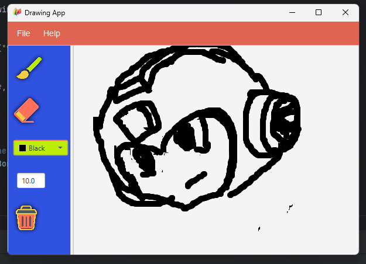

A drawing application built with **ScalaFX** and **JavaFX** as part of my coursework.  
It allows users to sketch on a canvas, switch between brush and eraser tools, change brush size and colors, and save drawings as PNG images.

## Features
- Brush and eraser tools
- Adjustable brush size
- Color picker
- Save canvas as PNG
- MVC architecture

## Tech Stack
- Scala 2.12.19  
- JavaFX 17  
- ScalaFX 17  

## How to Run
1. Install JDK 17 and SBT.  
2. Clone the repo:  
   ```bash
   git clone https://github.com/<your-username>/DrawingApp.git
   cd DrawingApp
   sbt run

Here is an example drawing demonstrating the user interface with brush, eraser, color picker, brush size control, and save options.




Here is a sample drawing created with multiple colors, showing the app’s color selection and drawing capabilities.

